# SAP-1 MK2 8-bit Computer

[![Computer Architecture](https://img.shields.io/badge/Computer_Architecture-B03931?style=flat&logo=data:image/svg+xml;base64,PCFET0NUWVBFIHN2ZyBQVUJMSUMgIi0vL1czQy8vRFREIFNWRyAxLjEvL0VOIiAiaHR0cDovL3d3dy53My5vcmcvR3JhcGhpY3MvU1ZHLzEuMS9EVEQvc3ZnMTEuZHRkIj4KDTwhLS0gVXBsb2FkZWQgdG86IFNWRyBSZXBvLCB3d3cuc3ZncmVwby5jb20sIFRyYW5zZm9ybWVkIGJ5OiBTVkcgUmVwbyBNaXhlciBUb29scyAtLT4KPHN2ZyB3aWR0aD0iODAwcHgiIGhlaWdodD0iODAwcHgiIHZpZXdCb3g9IjAgMCAyNCAyNCIgaWQ9IkxheWVyXzEiIGRhdGEtbmFtZT0iTGF5ZXIgMSIgeG1sbnM9Imh0dHA6Ly93d3cudzMub3JnLzIwMDAvc3ZnIiBmaWxsPSIjMDAwMEZGRkZGRiIgc3Ryb2tlPSIjMDAwMEZGRkZGRiI+Cg08ZyBpZD0iU1ZHUmVwb19iZ0NhcnJpZXIiIHN0cm9rZS13aWR0aD0iMCIvPgoNPGcgaWQ9IlNWR1JlcG9fdHJhY2VyQ2FycmllciIgc3Ryb2tlLWxpbmVjYXA9InJvdW5kIiBzdHJva2UtbGluZWpvaW49InJvdW5kIi8+Cg08ZyBpZD0iU1ZHUmVwb19pY29uQ2FycmllciI+Cg08ZGVmcz4KDTxzdHlsZT4uY2xzLTF7ZmlsbDpub25lO3N0cm9rZTojZmZmZmZmO3N0cm9rZS1taXRlcmxpbWl0OjEwO3N0cm9rZS13aWR0aDoxLjkycHg7fS5jbHMtMntmaWxsOiNmZmZmZmY7fTwvc3R5bGU+Cg08L2RlZnM+Cg08cmVjdCBjbGFzcz0iY2xzLTEiIHg9IjUuMjkiIHk9IjUuMjkiIHdpZHRoPSIxMy40MiIgaGVpZ2h0PSIxMy40MiIgcng9IjIuMjQiLz4KDTxsaW5lIGNsYXNzPSJjbHMtMSIgeDE9IjcuMjEiIHkxPSIwLjUiIHgyPSI3LjIxIiB5Mj0iNS4yOSIvPgoNPGxpbmUgY2xhc3M9ImNscy0xIiB4MT0iMTIiIHkxPSIwLjUiIHgyPSIxMiIgeTI9IjUuMjkiLz4KDTxsaW5lIGNsYXNzPSJjbHMtMSIgeDE9IjE2Ljc5IiB5MT0iMC41IiB4Mj0iMTYuNzkiIHkyPSI1LjI5Ii8+Cg08bGluZSBjbGFzcz0iY2xzLTEiIHgxPSI3LjIxIiB5MT0iMTguNzEiIHgyPSI3LjIxIiB5Mj0iMjMuNSIvPgoNPGxpbmUgY2xhc3M9ImNscy0xIiB4MT0iMTIiIHkxPSIxOC43MSIgeDI9IjEyIiB5Mj0iMjMuNSIvPgoNPGxpbmUgY2xhc3M9ImNscy0xIiB4MT0iMTYuNzkiIHkxPSIxOC43MSIgeDI9IjE2Ljc5IiB5Mj0iMjMuNSIvPgoNPGxpbmUgY2xhc3M9ImNscy0xIiB4MT0iMC41IiB5MT0iMTYuNzkiIHgyPSI1LjI5IiB5Mj0iMTYuNzkiLz4KDTxsaW5lIGNsYXNzPSJjbHMtMSIgeDE9IjAuNSIgeTE9IjEyIiB4Mj0iNS4yOSIgeTI9IjEyIi8+Cg08bGluZSBjbGFzcz0iY2xzLTEiIHgxPSIwLjUiIHkxPSI3LjIxIiB4Mj0iNS4yOSIgeTI9IjcuMjEiLz4KDTxsaW5lIGNsYXNzPSJjbHMtMSIgeDE9IjE4LjcxIiB5MT0iMTYuNzkiIHgyPSIyMy41IiB5Mj0iMTYuNzkiLz4KDTxsaW5lIGNsYXNzPSJjbHMtMSIgeDE9IjE4LjcxIiB5MT0iMTIiIHgyPSIyMy41IiB5Mj0iMTIiLz4KDTxsaW5lIGNsYXNzPSJjbHMtMSIgeDE9IjE4LjcxIiB5MT0iNy4yMSIgeDI9IjIzLjUiIHkyPSI3LjIxIi8+Cg08Y2lyY2xlIGNsYXNzPSJjbHMtMiIgY3g9IjE1LjgzIiBjeT0iOC4xNyIgcj0iMC45NiIvPgoNPC9nPgoNPC9zdmc+&logoColor=white)]()
[![Digital Logic](https://img.shields.io/badge/Digital_Logic-6A0DAD?style=flat&logo=data:image/svg+xml;base64,PD94bWwgdmVyc2lvbj0iMS4wIiBlbmNvZGluZz0idXRmLTgiPz48IS0tIFVwbG9hZGVkIHRvOiBTVkcgUmVwbywgd3d3LnN2Z3JlcG8uY29tLCBHZW5lcmF0b3I6IFNWRyBSZXBvIE1peGVyIFRvb2xzIC0tPgo8c3ZnIHdpZHRoPSI4MDBweCIgaGVpZ2h0PSI4MDBweCIgdmlld0JveD0iMCAwIDUxMiA1MTIiIHhtbG5zPSJodHRwOi8vd3d3LnczLm9yZy8yMDAwL3N2ZyI+PHBhdGggZmlsbD0iI0ZGRkZGRiIgZD0iTTExNi42IDQwN2M0MC00NS45IDYwLjQtOTguNCA2MC40LTE1MSAwLTUyLjYtMjAuNC0xMDUuMS02MC40LTE1MUgxOTJjMzQuMSAwIDgxLjkgMzQgMTE5LjMgNzEuNCAxOC43IDE4LjYgMzUuMSAzNy45IDQ2LjYgNTMuMyA1LjggNy42IDEwLjQgMTQuNCAxMy40IDE5LjQgMS40IDIuNSAyLjUgNC43IDMuMiA2LjEuMS40LjIuNS4yLjggMCAuMy0uMS41LS4yLjktLjYgMS40LTEuNyAzLjUtMy4yIDYtMyA1LjEtNy41IDExLjgtMTMuMiAxOS41LTExLjMgMTUuNC0yNy41IDM0LjYtNDYuMSA1My4yQzI3NC44IDM3MyAyMjcuMSA0MDcgMTkyIDQwN3pNMTYgMzYxdi0xOGgxMjIuMmMtMyA2LjEtNi4zIDEyLjEtOS45IDE4em0zNzQuNS05NmMuMi0uMy40LS43LjUtMSAxLjEtMi40IDItNC40IDItOCAwLTMuNi0xLTUuNi0yLTgtLjEtLjMtLjMtLjctLjUtMUg0OTZ2MTh6TTE2IDE2OXYtMThoMTEyLjNjMy42IDUuOSA2LjkgMTEuOSA5LjkgMTh6Ii8+PC9zdmc+&logoColor=white)]()

PCB version of my previous [SAP-1 project](https://github.com/kyriosaa/sap1).

Still very much a WIP but here are the finished schematics:

## Root
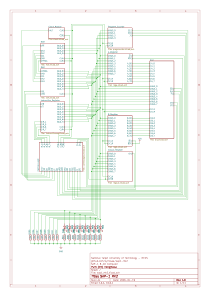

## Clock Module
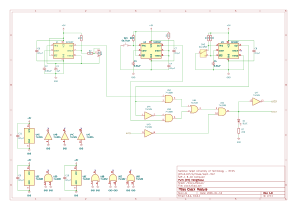

## A Register
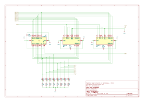

## B Register
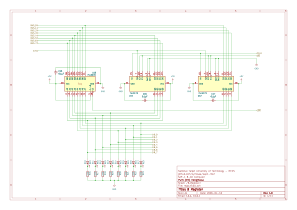

## Instruction Register
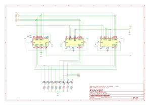

## Arithmetic Logic Unit (ALU)
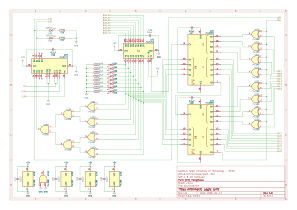

## Memory Address Register (MAR)
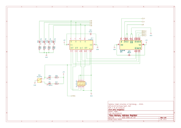

## Random Access Memory (RAM)
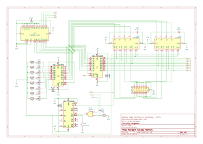

## Program Counter
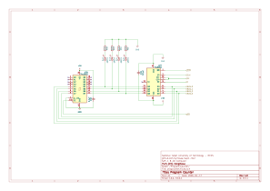

## Output Register
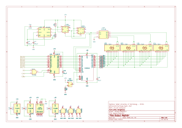

## Control Logic
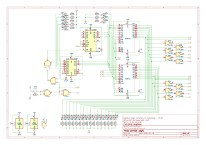